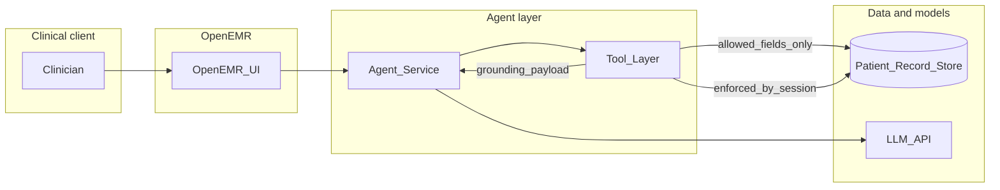

# AgentForge — Clinical Co-Pilot: working synthesis

This document **interprets and extends** the official project requirements. It is a **working reference** for architecture, scope, and interview prep. The authoritative source remains the PRD: [SPECS.txt](SPECS.txt) and `Week 1 - AgentForge.pdf` in this folder.

---

## 1. Purpose and scope

- **Use this file for:** consolidation of goals, gaps, questions, risks, personas, and design threads that span the official spec and team discussion.
- **Do not treat this file as:** a substitute for `AUDIT.md`, `ARCHITECTURE.md`, or the user/use-case document required by Gauntlet; those must still be written against the PRD.
- **Traceability:** Every feature and tradeoff in the real deliverables should still trace to the case study: *reliable, fast, secure access to patient data* with defensible trust boundaries.

---

## 2. Core ask (one paragraph)

Build a **Clinical Co-Pilot**—a **patient-aware**, **multi-turn**, **tool-using AI agent** **embedded in OpenEMR**—that helps a clinician get the **context they need at the moment they need it** (e.g. who they are seeing, why, what changed, what is on file, what matters today) through a **conversation-style** interface. It is **not** a generic medical Q&A chatbot. It must use **this patient’s** chart data, enforce **who may see what**, pass responses through a **verification** step so claims are **grounded in the record**, and ship with **observability** and an **evaluation** suite you can defend. The bar is an agent you could explain to a **hospital CTO**, not only a polished demo.

---

## 3. PRD summary (from SPECS)

### Scenario and motivation

- **Time pressure:** e.g. ~90 seconds between patient rooms; dense EHR UI makes recall slow and error-prone.
- **Stakes:** Hallucinations and overconfident wrong answers can **harm patients**; trust and traceability are first-class.

### Hard problems (explicit in PRD)

| Area | What the PRD requires |
| --- | --- |
| **Authorization** | Know **who** is asking; enforce access (physician / nurse / resident / etc.); multi-user clinical reality. |
| **Verification** | Claims traceable to **sources in the record**; respect **domain constraints** (how enforced is a design you own). |
| **Speed vs completeness** | Answers in **seconds**; may need multiple tools; **tradeoffs and uncertainty** must be explicit. |
| **HIPAA / PHI** | Shapes storage, transmission, logging, access; audit and architecture must show **understanding**, not acronym use. **Demo data only** in the codebase. |
| **Failure modes** | Tool failure, incomplete records, odd model output → **graceful degradation**, visible errors, predictable behavior. |

### Codebase

- **Fork** [openemr/openemr](https://github.com/openemr/openemr); integrate **into** the system, not a parallel toy app.
- **Gate:** **Audit before building the AI layer** (hard gate).
- **Austin track:** project completion and **interviews** both required per checkpoint.

### Checkpoints (Central / Austin; from schedule table in SPECS)

| Checkpoint | Deadline (per PRD table) | Focus |
| --- | --- | --- |
| Architecture Defense | 24 hours | Research and planning |
| MVP | Tuesday 11:59 PM | App audit, agent plan, **deployed app**, demo video; interview within 24h of submit |
| Early Submission | Thursday 11:59 PM | **Deployed agent**, eval framework, observability, demo video; interview within 24h |
| Final | **Sunday @ Noon** (per table) | Production-ready agent, demo video, **social post**; interview within 24h |

**Ambiguity (see section 4):** Submission block also states **Final deadline: Sunday 10:59 PM CT**—**confirm with Gauntlet** which controls.

### MVP stages (not “a working agent” for MVP)

1. Run OpenEMR **locally** with sample patients.  
2. **Deploy** publicly; URL required for submissions.  
3. **Audit** (written findings) — security, performance, architecture, data quality, compliance.  
4. **Users and use cases** (narrow user, concrete workflow).  
5. **Agent plan** (`ARCHITECTURE.md`) — no full implementation required at MVP if PRD is followed as written for that stage.

### Hard-gate documents (names from PRD)

- `./AUDIT.md` — full audit; **~500 word** opening summary of key findings.  
- User/use-case doc — see **section 4** (filename conflict between stages and submission table).  
- `./ARCHITECTURE.md` — integration plan; **~500 word** opening summary; trace to user doc.

### Required agent components (PRD)

1. **Agentic chatbot** — multi-turn, context, **tools**; surface area must **map to use cases** in the user doc (no feature sprawl).  
2. **Verification** — **source attribution**; **domain constraint** handling (scope you define and document).  
3. **Observability** — at minimum: ordered steps, timing, tool failures, token/cost usage.  
4. **Evaluation** — intentional pass/fail; **unhappy paths** and **unauthorized access** attempts, not only demos.

### Submission deliverables (PRD list)

- GitHub repo (OpenEMR fork), setup guide, architecture overview, **deployed link**  
- `AUDIT.md`, user doc, `ARCHITECTURE.md`  
- Demo video (3–5 min) per submission where required  
- Eval dataset with results  
- **AI cost analysis** — actual dev spend + projected costs at **100 / 1K / 10K / 100K** users, including **architectural** changes at scale (not `cost_per_token × n` only)  
- Deployed app; for early/final, **agent works live**  
- Social post (final only), tag @GauntletAI  

---

## 4. Internal ambiguities in the spec (clarify with Gauntlet)

| Issue | What SPECS says | Suggested action |
| --- | --- | --- |
| **User document filename** | Stage 4 hard-gates **`./USERS.md`**; submission table lists **`./USER.md`**. | Ask which is canonical; until then, **pick one name** and note the mismatch in your repo README or cover note. |
| **Final deadline** | Schedule: **Final — Sunday @ Noon**; submission block: **Sunday 10:59 PM CT**. | **Confirm** which timestamp is binding for “final” submission. |
| **Appendix vs core** | Prompt injection, etc. appear in **appendix checklist**, not always as hard requirements. | Treat as **strong planning**; for interviews, be ready to discuss even if not every item is a formal gate. |

Do **not** silently paper over these—call them out in your own project notes.

---

## 5. What the PRD does not say (deliberate or risky gaps)

- **Where** in OpenEMR the agent lives (module, API, iframe, new route)—your design.  
- **Concrete stack** (language, agent framework, LLM provider, hosting).  
- **SLAs** (e.g. p95 latency in seconds)—you define “fast enough” for your user.  
- **MVP feature checklist** for the **agent** beyond “plan + deploy + audit + users”—clarify per checkpoint with staff if needed.  
- **Prompt injection / tool abuse** as a named requirement in the main text (appendix touches related ideas).  
- **PHI in observability vendor logs**—tension with HIPAA; you must own **redaction, retention, and subprocessors** in your architecture story.  
- **Regulatory scope** beyond HIPAA (e.g. CDS / FDA / state rules)—not the focus of the PRD, but “real hospital” interviews may go there.  
- **Accessibility, i18n, mobile**—not specified; optional for the sprint if you scope explicitly.  
- **OpenEMR version** pinning and upgrade path—your operational choice.

---

## 6. Questions to ask (buckets)

### Program / process

- Canonical **`USER.md` vs `USERS.md`**; final **noon vs 10:59 PM** deadline.  
- What “**production-ready**” means for **Final** vs “**deployed agent**” for **Early**.  
- Any **hosting or region** expectations for the public URL.

### Product / user

- **One** primary user and **one** moment in the day the co-pilot must win.  
- What the agent must **refuse** (e.g. unsourced facts, out-of-scope advice).  
- “Good enough” when the chart is **incomplete**.

### Authorization / data

- How **OpenEMR session/roles** map to **tool permissions** and **patient** scope.  
- How you prevent **wrong-patient** context (binding patient id to session and tools).

### Trust / verification

- What counts as a **factual claim** vs neutral framing.  
- Where verification runs (post-hoc, constrained generation, tool-only facts).

### Security / misuse

- **Prompt injection** and **unauthorized inference** (e.g. “fetch another patient’s data”).  
- What may be **logged** and what must be **redacted**.

### Observability

- Minimum **dashboard or query** for health; **incident**-useful events.

### Eval

- **Pass/fail** rules; **ground truth** for demo data; **adversarial** cases required.

### OpenEMR / engineering

- **Tool** boundaries (SQL vs API vs PHP-internal); what is **forbidden**.  
- **Version** of OpenEMR to fork and document.

### Demo / checkpoints

- What each **video** must show (audit-only vs live agent) per stage.

### Meta (interview standard from PRD)

- *If a hospital CTO asked why this is safe and useful, what evidence would we show, and what are we honestly unsure about?*

---

## 7. Format and device (tablet, desktop, mobile)

The PRD does **not** mandate a form factor. It does imply **very short attention** and **in-motion** use (e.g. between rooms).

### Practical approach

- Tie **one primary** form factor to the **user** in your user doc (e.g. desktop in exam room vs hallway tablet).  
- **Defer** full responsive/mobile polish if out of scope—**state** that in `ARCHITECTURE.md` or the user doc.  
- The **90-second physician** is a **flagship** scenario in the PRD, not a claim that **all** users are identical (see section 12).

---

## 8. Risks and severity

| Risk | Severity | Note |
| --- | --- | --- |
| **Wrong patient / wrong context** | Critical | Most harmful class of EHR+AI failure. |
| **Authorization bypass** (user sees data they should not) | Critical | Enforce in **server-side tools**, not prompt text. |
| **Hallucinated or ungrounded clinical facts** | Critical | PRD: claims must trace to the record. |
| **PHI in third-party logs / traces** | High | Required observability vs privacy—design explicitly. |
| **Conflicting or stale chart data** | High | Do not **invent** reconciliation (see section 13). |
| **Latency** (slow path to answer) | High | Trade completeness vs speed; **signal** uncertainty. |
| **Tool or LLM outage** | High | Graceful errors, not silent failure. |
| **Mobile / tablet polish** | Medium | Unless your primary user is mobile-first. |

---

## 9. Cost structure

### Buckets to model (for the required **AI cost analysis** and real budgeting)

1. **LLM inference** — tokens, model choice, context size, calls per visit.  
2. **Hosting** — OpenEMR (PHP, DB), agent service, networking; **PaaS** (e.g. Railway, Fly, Render) is a reasonable **demo** choice if documented.  
3. **Observability** — event volume, retention, possible vendor fees.  
4. **Egress / storage** — often secondary to LLM for this use case.

The PRD explicitly wants projections at **100 / 1K / 10K / 100K** users and **architectural** changes (caching, batching, smaller models, regional routing, etc.)—**not** only `tokens × users`.

---

## 10. Privacy and assumptions

- **PHI** under HIPAA: storage, transmission, access control, and **logging** must be thought through in `AUDIT.md` and `ARCHITECTURE.md`.  
- **Data minimization** to the model: prefer **retrieved, cited chunks** over full-chart dumps when possible.  
- **PRD note:** act **as if** BAA and no training on PHI with LLM providers—**for a class / demo**, teams often **additionally** state their own assumption (e.g. public API policies, demo-only data). Distinguish **exercise** from **real production** where **BAAs and DPAs** are mandatory.  
- **Observability:** define what is **redacted** or **never** sent to external trace stores.

---

## 11. Access, roles, and how

### Pattern that matches the PRD

- Clinician **authenticates in OpenEMR** as today.  
- The co-pilot runs in a context that carries **proven identity** (session, token, or server-side binding).  
- **Every** data tool takes **user + patient (and encounter as needed)** and checks **OpenEMR-consistent permissions** before returning fields.  
- The LLM only sees what **tools** return.

### Role matrix (for documentation—even if you only code one path)

| Persona | Often different from PCP | Implication |
| --- | --- | --- |
| **Primary care / ambulatory** | Longitudinal “what changed” | Your PRD default story. |
| **ED** | Triage, discrete facts fast | Shorter context, different goals. |
| **Nurse** | Tasks, meds, contraindications, handoff | May differ in **allowed data** in real orgs. |
| **Non-clinical** | Often **no** direct patient access | Deny by default. |
| **Paramedic / prehospital** | May lack full OpenEMR | May be **out of scope** for “embedded in OpenEMR” unless you define **handoff** data—**future work**. |

---

## 12. Clinical priorities and personas

### Typical clinician priorities (for narrative—tie to *your* user)

1. **Safety** — not wrong, not overconfident.  
2. **Relevance** — what matters **today** for **this** visit.  
3. **Speed** — seconds, not a research session.  
4. **Provenance** — where in the chart the answer came from.  
5. **Actionability** — what to re-check or ask, without the agent **ordering** care unless you explicitly build and govern that (not required by the PRD).

### Doctor vs nurse vs other

- **Yes**, real priorities differ: scope, time horizon, and allowed actions differ.  
- **Sprint strategy:** **one** narrow user + use cases in the required doc; **name** other personas, **defer** or scope them, and design **architecture** so adding a role is **new tools + ACL + prompts**, not a full rewrite.  
- **“Think for later”:** multi-mode UX (e.g. 30-second triage vs deep prep), **role-aware** tool sets, and **separate** workflows for **lots vs little time**—not one chat template for everyone.

The **90-second doctor** in the PRD is the **anchor** scenario, **not** the only valid real-world use case.

---

## 13. Conflicting chart data

The PRD does **not** pick a single rule for “which note wins.”

### Defensible patterns

- **Show conflict explicitly** with **citations** (date, author, source type): “Source A says …; Source B says ….”  
- **Prefer structured** data (problem list, med list, signed orders) over free text when the system exposes them and your use case allows.  
- **Newer / signed** as a **default ranking** *only* for *summary prioritization*, not as silent truth—**conflict still visible** when it matters.  
- **Do not** invent a **merged** story that the chart does not support.  
- **Strategic question:** Is the co-pilot’s job to **arbitrate medical truth** or to **surface disagreement safely**? The PRD leans **grounding and traceability**, not omniscience.

---

## 14. Hallucination: mitigate and set expectations

### Mitigation (engineering)

- **Tool-grounded** answers: generate from **retrieved** record slices, not uncited memory.  
- **Verification layer** (required): **no** unsupported **factual** claims; **cite or abstain**.  
- **Structured tool outputs** (e.g. fact + record id) the model is allowed to verbalize.  
- **Evaluations** on known demo charts; **regressions** when changing prompts or models.  
- **Adversarial** cases: cross-patient prompts, “ignore instructions,” etc.  
- **Refuse** or narrow when data is missing.

### Expectations

- You **do not** “prove zero hallucination”; you **constrain the channel** and **measure** behavior, and you document **known limitations** honestly (the PRD invites that).

---

## 15. Trust boundaries (reference diagram)

Auth and policy enforcement belong **on the path to data**, not only in the model prompt.

### Intent

The **Tool_Layer** (or equivalent) enforces **who** can read **what**; the model sees **only** tool outputs you allow.

---

## 16. Links (starting points)

- **OpenEMR (fork source):** [https://github.com/openemr/openemr](https://github.com/openemr/openemr)  
- **HIPAA (HHS):** [https://www.hhs.gov/hipaa/for-professionals/privacy/laws-regulations/index.html](https://www.hhs.gov/hipaa/for-professionals/privacy/laws-regulations/index.html)  
- **NIST AI Risk Management Framework (trustworthiness framing, not a substitute for your design):** [https://www.nist.gov/itl/ai-risk-management-framework](https://www.nist.gov/itl/ai-risk-management-framework)  

---

## 17. Conversation and decision log (prompts to revisit)

Use these as standing agenda items for the team and for `ARCHITECTURE.md` / interviews:

- **Primary persona this sprint:** who, and **why** we are not optimizing others yet.  
- **Conflict policy:** arbitrate vs surface both; how **citations** work in the UI.  
- **Logging / PHI:** what is **redacted by default**; what is **needed** for debugging incidents.  
- **Verification:** structural rule (“no cite → no assert fact”) vs only **post-hoc** checks.  
- **Public demo URL:** which **data** is present; **no real PHI** in the codebase (per PRD).  
- **Deployment:** e.g. Railway or similar—**one** stack, **document** env vars and **what runs where**.  
- **Known limitations:** one honest paragraph the CTO could read.

---

*Synthesis compiled from the AgentForge PRD ([SPECS.txt](SPECS.txt)) and working discussion. Update this file as decisions land.*
