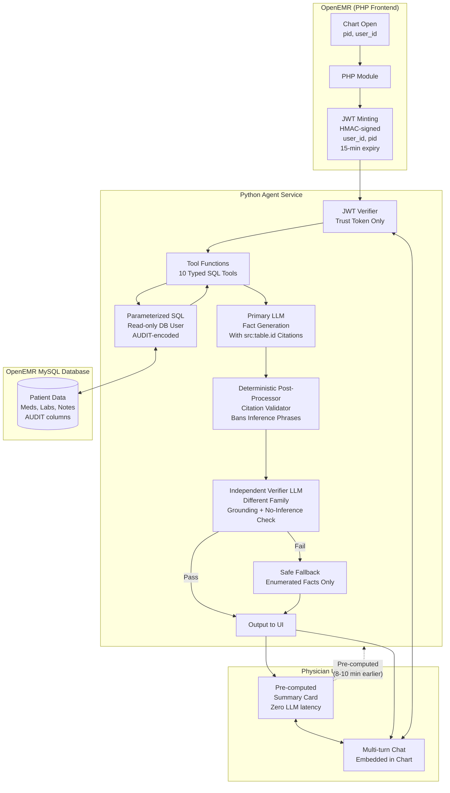

# Architecture Defence SIMPLE — Clinical Co-Pilot

## Big idea

Doctors have about 90 seconds at the start of a visit to get re-oriented.
This system is only useful if it quickly shows chart-backed facts and never invents facts.

## 1) Split into two services (PHP + Python)

- PHP side stays inside OpenEMR and handles sessions, ACL, CSRF, and UI.
- Python side handles LLM/tool logic.
- They talk over private HTTP.

Why this choice:

- OpenEMR-specific security/session behavior is easier to keep in PHP.
- Agent logic is easier to build and maintain in Python.
- Clear separation keeps risk lower.

Tradeoff:

- One extra network hop and two deployable services.

## 2) Patient identity comes from JWT only

- PHP creates a short-lived JWT (15 minutes) with user + patient context.
- Python trusts only the verified token for patient identity.
- Python does not trust patient IDs from request body or model tool arguments.

Why this choice:

- Prevents "wrong patient" prompt injection paths.
- Enforces identity/authorization at the boundary.

Current limitation:

- No token revocation list yet; expiry window is the safety control in v1.

## 3) Use direct SQL tools, not RAG (for v1)

- The assistant uses typed tools with parameterized SQL.
- Database account is read-only and limited to needed clinical tables.
- Tools handle known OpenEMR data quirks in one place.

Why this choice:

- Current use cases are structured data questions.
- SQL against source-of-truth rows is more reliable than semantic retrieval for this scope.

When this changes:

- If we add heavy free-text note search, RAG may become necessary.

## 4) Two user experiences, one backend

- A precomputed summary card is generated before chart-open and served fast.
- A live chat uses the same backend tools/citations for follow-up.

Why this choice:

- The summary gives instant value at room-entry time.
- Chat gives depth without building a second logic path.

Staleness handling:

- Show a staleness banner instead of blocking; transparency over hidden delay.

## 5) Three-layer safety + citation rules

Every claim must include a citation like `[src:table.id]`.

Safety checks:

1. Prompt requires grounded, cited output.
2. Deterministic post-check verifies citations and scans banned phrasing.
3. Independent verifier model checks output before final display.

If checks fail:

- Return a safe fallback listing rows directly.
- Do not output uncited or inferred claims.

## Clinical safety boundary (non-negotiable)

This product is facts-only from the chart.
It does **not** provide:

- diagnosis
- treatment recommendations
- dose changes
- causal medical reasoning

## What this does NOT claim

It does not claim "LLM is safe in general."
It claims the displayed output is constrained by:

- chart citations
- deterministic checks
- independent verification
- safe fallback behavior

## Known weak spots (open and acknowledged)

- Current eval set is useful but not full coverage.
- Verifier blind spots may exist until more adversarial testing is added.
- v1 authz policy is permissive by default, with a clean seam for stricter policy.

