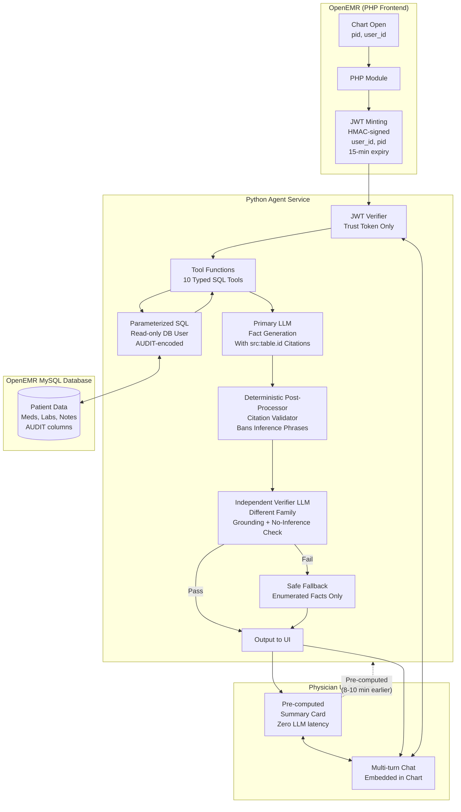

# Architecture Defense — Clinical Co-Pilot

> This is a defense brief. Canonical implementation detail and source-of-truth architecture remain in [ARCHITECTURE.md](ARCHITECTURE.md).

**Thesis.** A primary-care physician's first 90 seconds in a 15-minute slot is re-orientation, not reasoning. The agent earns its place only if it surfaces chart-cited facts during that window and never adds a fact the chart doesn't support. Every choice below is downstream of that.

---

## The five load-bearing choices

### 1. Two-process split: PHP module ↔ Python agent service over HTTP

Agent lives at `interface/modules/custom_modules/clinical-copilot/`; LLM work is in a separate Python container, reachable only on the private network.

- **Why:** OpenEMR's session model, ACL surface (`AclMain`), and `EventDispatcher` hygiene (AUDIT A1/A2/A6) are not things we want to fix to ship an agent. Splitting lets PHP speak OpenEMR idioms (CSRF, Twig, `$_SESSION`) and Python speak agent idioms (typed config, async SDKs, structured logs). One translation layer — JWT over HTTP — is the entire integration surface.
- **Cost paid:** two deployables, one extra hop. Acceptable.
- **Where this could be wrong:** if a customer needs voice/dictation or sub-100ms chat round-trip, the hop hurts. v1 doesn't.

### 2. Identity by short-lived JWT, never by request body

PHP mints an HMAC-SHA256 JWT carrying `(user_id, pid, exp:+15min, jti)` per chart-open and per chat turn. Python tools read `pid` only from the verified token — never from the request body, never from an LLM tool argument.

- **Why:** wrong-patient prompt injection ("look up Eduardo's labs") is closed cryptographically, not hopefully. AUDIT A2/A8 (no service-layer principal) is solved by typing the principal at the dispatcher boundary instead of patching OpenEMR's session reach-in.
- **Authorization seam.** `PatientAccessPolicy` is a Protocol with a permissive demo impl in v1 and a `ProviderOfRecordPolicy` sketch for production. Swappable without touching tool code.
- **Honest gap:** no token revocation list. 15-min `exp` is the only revocation in v1.

### 3. Direct parameterized SQL, no RAG

Ten typed Python tools, each emitting fixed SQL against a read-only MySQL user with `SELECT` on clinical tables only.

- **Why:** the four use cases ("what changed since last visit," "any med interactions," "A1C trend," "what's new in last N days") are structured-data questions. Truth lives in rows with dates, codes, IDs. Cosine similarity on chunked prose is a fidelity-loss step over data that is already typed and queryable.
- **AUDIT D3/D4/D5/D8 baked in once** in `clinical_filters.py` (soft-deletes, polymorphic `lists.type`, dual-storage meds, `provider_id=0` system rows) — invisible to the LLM and the prompt author.
- **Where this could be wrong:** the moment use cases extend to free-text note search, RAG earns its keep. v1 doesn't go there.

### 4. Two surfaces, one backend

Pre-computed summary card (Redis-cached, fired by check-in event ~10min before chart-open, served in <100ms) **and** multi-turn chat drilling into the same tools and citations.

- **Why:** the card is "the chat with one prompt nobody typed yet." Zero LLM latency on the doorknob moment; chat reuses the exact same code path. Pre-compute exploits the only free latency budget in the system — the gap between front-desk check-in and the doctor walking in.
- **Staleness handled by banner**, not by blocking; staleness-with-banner is a feature, not an error.

### 5. Three-layer verification with a citation grammar

Every clinical claim carries inline `[src:table.id]` anchored to a tool-returned row. (a) Prompt design, (b) deterministic post-processor (citation-existence + banned-phrase scan, <50ms), (c) independent verifier model (GPT-4.1-mini — deliberately a different family than the Haiku primary).

- **Failure mode:** falls through to a deterministic enumeration response ("here are the rows, I cannot summarize them safely"). Never silently strips claims.
- **Asymmetric tuning.** False-accept (recommendation pretending to be fact) is project-killer. False-reject (enumeration fallback) is UX cost. ≈2 orders of magnitude cost asymmetry → tune verifier over-eager. <1% false-accept is the line; <10% false-reject is acceptable.
- **The line that's never crossed:** surface chart-cited facts only. No recommendations, diagnoses, dose changes, or causal reasoning.

---

## What I'm explicitly NOT claiming

"The LLM is safe." I am claiming the **output reaching the user** is constrained by deterministic post-processing and an independent verifier, with a fallback that respects the no-inference rule under uncertainty. Generalisation to differential diagnosis or note authorship is a different product with a different verification model.

## Honest weakest spots

80-case eval gates project-killers, not coverage. Verifier has unknown blind spots until adversarial eval expands. Permissive demo authz policy is closed by the seam, not by v1 code. Each is named in [ARCHITECTURE.md](ARCHITECTURE.md) §12 with the compensating control and the signal that would change priority.

